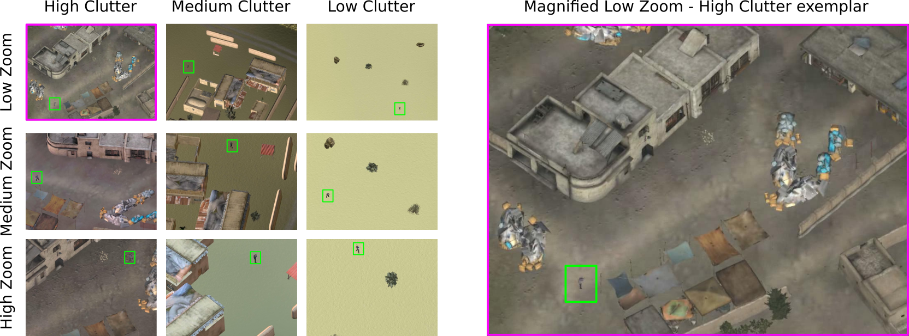

# SCORCH_Dataset
This dataset was created for the purpose of having complex visual search stimuli under controlled conditions. Analogous, to classic visual search tasks where the goal is to find a Gabor (target) in white/pink noise (background), this dataset provides a rich class of stimuli where the target is a person either armed or unarmed, in a scene background from an aerial point of view. Backgrounds were created with a computer graphics engine propiertary from NASA Ames Research Center.

The goal of having targets (people) with and without weapons, beyond having an application to surveillance scenario tasks, is to enable more complex visual search experiments where the target can either be armed/unarmed and the distractors can either be unarmed/armed respectively. The hope of this stimuli is also to have subjects perform this task while finding the stimuli more natural than performing search of a Gabor signal in a noise background. Benchmarking visual search tasks & models with this dataset is encouraged.

# Download RAW Video Dataset
$ wget -v -O SCORCH_Raw_Data.tgz -L https://ucsb.box.com/shared/static/h2xc3fbylxqt9epils1onsglyu2kere3.gz

# Download Stimuli used in the Attention Allocation Aid for Visual Search (2017) paper
 Coming Soon!

The Following public repository contains all the RAW stimuli regarding multiple papers that use the SCORCH Dataset.These papers include:

Attention Allocation Aid for Visual Search. Deza, Peters, Taylor, Surana & Eckstein. ACM CHI. 2017.

Can Peripheral Representations improve Clutter Metrics in Complex SceneS? Deza & Eckstein. NIPS. 2016.

